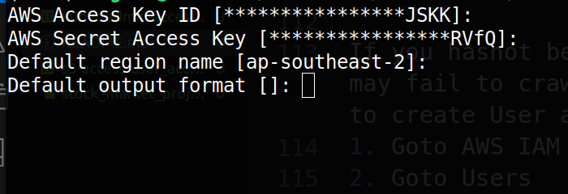

## Project: Real Time Data Engineering using Kafka

**System Architecture of the project**

---

**Requirement**
* AWS Account 
* Python3 
* Jupyter Notebook 

## AWS EC2
### Kafka
> AWS EC2 
1. Lunch Instance
2. Give the name of the server, create and download a key pair (your_project.pem) and lunch instance
3. Go to connect and copy the ssh client command
4. Follow the following kafka-command to run the kafka in the instance
---
**Open the Terminal and ssh to the cloud instances**
```
chmod 400 stock_market_project.pem
ssh -i "your_project.pem" ec2-user@ec2-3-24-135-147.ap-southeast-2.compute.amazonaws.com
```
---
**Inside the machine**


**Download kafka**
```
wget https://downloads.apache.org/kafka/3.6.0/kafka_2.13-3.6.0.tgz 
tar -xvf kafka_2.12-3.3.1.tgz
```
visit site ( https://downloads.apache.org/kafka ) for latest version and change accordingly

**Install Java**
```
java -version
sudo yum install java-1.8.0-amazon-corretto
java -version
```
**Start Zoo-keeper**
```
cd kafka_2.12-3.3.1
bin/zookeeper-server-start.sh config/zookeeper.properties
```
*keep it running.....*

*Open another window to start kafka as before*

As For Now, kafka server is pointing to private server ,so we need to change the server.properties so that it can run in public IP .
```
cd kafka_2.12-3.3.1
sudo nano config/server.properties
```
- change ADVERTISED_LISTENERS to public ip of the EC2 instance

Now we good to Go

**Allocate some memory to kafka server**
```
export
export KAFKA_HEAP_OPTS="-Xmx256M -Xms128M"
```
It doesnot run without it so keep in mind To check for kafka variables 

**Start Kafka-server**
```
bin/kafka-server-start.sh config/server.properties
```
*keep it running.......*

*Open another window to start kafka as before*

---
Now Create a topic to handle the real time data

**Create the topic**
```
cd kafka_2.12-3.3.1
bin/kafka-topics.sh --create --topic demo_topic1 --bootstrap-server 66.66.666.666:9092  --replication-factor 1 --partitions 1
```
publicIp = {Public IP of EC2 Instance:9092}, you can make multiple partition as your project server.

**Start Producer**
```
bin/kafka-console-producer.sh --topic demo_topic1 --bootstrap-server 66.66.666.666:9092
```

*keep it running.......*

*Open another window to start kafka as before*

**Start Consumer**
```
bin/kafka-console-consumer.sh --topic demo_topic1 --bootstrap-server 66.66.666.666:9092
```
Now you can see the data in the consumer segment in real time when data are sent from producer.
That's it , As for now you are able to run kafka manually in the instance.

> Now running the Producer and Consumer in your machine

Open the jupyter notebook and run codes.

---

[Screenshots]


---

## AWS S3

1. Goto Amazon S3
2. Create Bucket fill the unique name and desired region
3. Now you can upload the data in the bucket as per require.

---
[Screenshots]


---

## AWS IAM

If you hasnot been create any user and doesnot provide access to the user it may fail to crawle the data from S3 bucket to another platform. So, we need to create User as required the project.
1. Goto AWS IAM
2. Goto Users 
3. Create User fill the require name and other data,give administration access.
4. create access key and download the private access key. 
5. Download awscli in your machine. 
6. Configure the aws 
```
aws conifgure
```
7. fill the required key and region 
8. Goto Go.

---
[Screenshots]




---

## AWS Glue

It is used as crawler to fetch the data from S3 to the database

1. Goto AWS Glue
2. Navigate to crawler
3. create Crawler fill the name. 
4. choose the S3 bucket as from where you want to crawle the data.
5. create IAM role
6. create Database to store 
7. complete and run the crawler. It run, stop and ready to crawle the data.

---
[Screenshots]


---

## AWS Athena 
where you can query the database. 

---
[Screenshots]


---
---
---
<!-- <p style="text-align: center;">Thank you</p> -->
<p style="text-align: center;">Learn as if you will live forever, live like you will die tomorrow.</p>